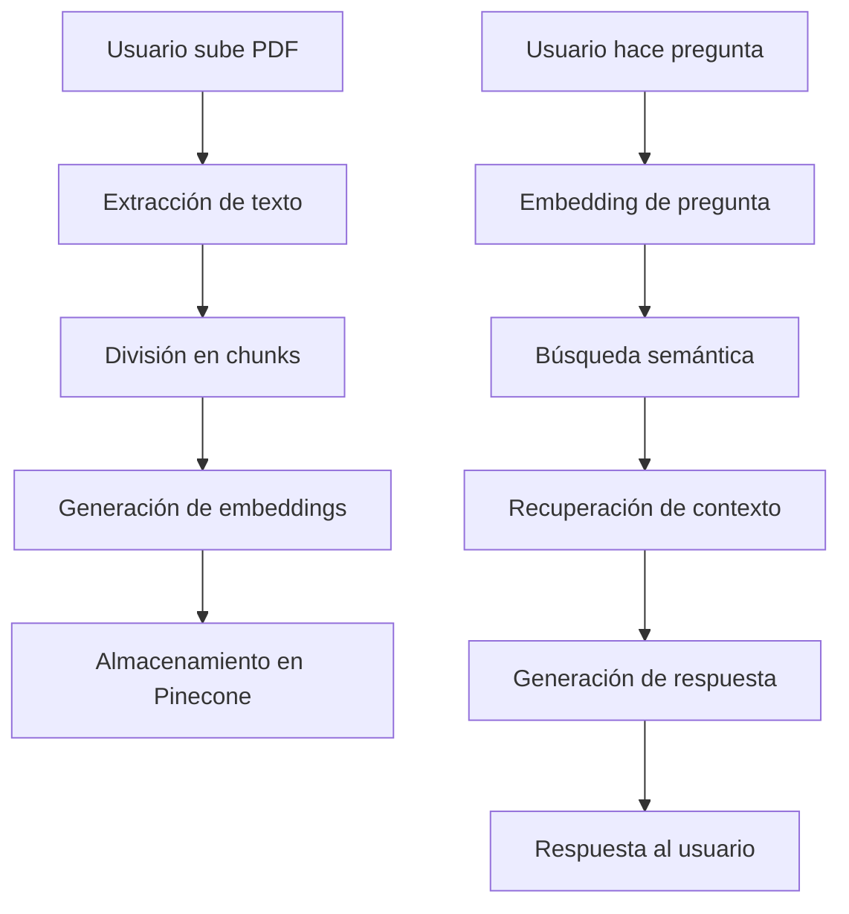

# 🏗️ Arquitectura del Sistema RAG Básico

## Visión General

El sistema RAG Básico implementa el patrón Retrieval-Augmented Generation usando una arquitectura moderna basada en Next.js con TypeScript.

## 🔄 Flujo de Datos Principal



## 🏛️ Arquitectura de Capas

### 1. Capa de Presentación (Frontend)

- **Framework**: Next.js 15 con App Router
- **UI**: React 19 + TypeScript + Tailwind CSS
- **Estado**: React hooks locales
- **Comunicación**: Fetch API para llamadas REST

### 2. Capa de API (Backend)

- **Runtime**: Next.js API Routes
- **Lenguaje**: TypeScript
- **Validación**: Validación manual de tipos
- **Manejo de errores**: Try-catch con respuestas estructuradas

### 3. Capa de Lógica de Negocio

- **Procesamiento PDF**: pdf-parse + js-tiktoken
- **Operaciones vectoriales**: OpenAI SDK + Pinecone SDK
- **Configuración**: Variables de entorno centralizadas

### 4. Capa de Datos

- **Vector DB**: Pinecone (embeddings + metadata)
- **Archivos**: Procesamiento en memoria (sin persistencia)
- **Estado**: Sin base de datos tradicional

## 📦 Componentes Principales

### Frontend Components

#### `UploadPage`

```typescript
interface UploadPageState {
  file: File | null;
  uploadStatus: "idle" | "uploading" | "success" | "error";
  processingInfo: ProcessingInfo | null;
  error: string | null;
}
```

**Responsabilidades:**

- Validación de archivos PDF
- Upload con progress feedback
- Navegación automática post-upload

#### `ChatPage`

```typescript
interface ChatPageState {
  messages: Message[];
  input: string;
  isLoading: boolean;
  hasDocument: boolean;
  currentDocumentId: string | null;
}
```

**Responsabilidades:**

- Interfaz de chat conversacional
- Detección de cambios de documento
- Manejo de estados de carga

#### `DocumentStatus`

```typescript
interface DocumentStatusState {
  status: StatusResponse | null;
  loading: boolean;
}
```

**Responsabilidades:**

- Indicador visual de estado
- Polling automático cada 3 segundos
- Información de documento actual

### Backend API Routes

#### `/api/upload`

```typescript
POST /api/upload
Content-Type: multipart/form-data

Request: FormData { file: File }
Response: {
  success: boolean;
  documentInfo?: {
    filename: string;
    chunks: number;
    documentId: string;
  };
  error?: string;
}
```

**Flujo de procesamiento:**

1. Validación de archivo (tipo, tamaño)
2. Extracción de texto con pdf-parse
3. División en chunks con js-tiktoken
4. Limpieza de embeddings anteriores
5. Generación de embeddings con OpenAI
6. Almacenamiento en Pinecone

#### `/api/chat`

```typescript
POST /api/chat
Content-Type: application/json

Request: { message: string }
Response: {
  answer: string;
  similarity: number;
  chunk: string;
  error?: string;
}
```

**Flujo de consulta:**

1. Generación de embedding de pregunta
2. Búsqueda semántica en Pinecone (top-5)
3. Selección del mejor match
4. Generación de respuesta con GPT-3.5-turbo
5. Retorno con metadata

#### `/api/status`

```typescript
GET /api/status

Response: {
  hasDocument: boolean;
  documentInfo?: {
    filename: string;
    chunks: number;
    uploadedAt: string;
  };
}
```

### Utility Libraries

#### `pdfProcessor.ts`

```typescript
export async function extractTextFromPDF(buffer: Buffer): Promise<string>;
export function chunkTextByTokens(
  text: string,
  chunkSize?: number,
  overlap?: number
): string[];
export function validatePDF(file: File): { valid: boolean; error?: string };
```

#### `vectorOperations.ts`

```typescript
export async function generateEmbedding(text: string): Promise<number[]>;
export async function storeEmbeddings(
  chunks: string[],
  filename: string
): Promise<StoreEmbeddingsResult>;
export async function searchSimilarChunks(
  query: string,
  topK?: number
): Promise<SearchResult[]>;
export async function clearAllEmbeddings(): Promise<void>;
export async function generateChatResponse(
  query: string,
  context: string
): Promise<string>;
```

## 🔧 Configuración y Constants

### `constants.ts`

```typescript
export const CONFIG = {
  CHUNK_SIZE: 400,           // Tokens por chunk
  CHUNK_OVERLAP: 80,         // Superposición entre chunks
  MAX_FILE_SIZE: 10MB,       // Límite de archivo
  EMBEDDING_MODEL: "text-embedding-3-small",
  CHAT_MODEL: "gpt-3.5-turbo",
  MAX_TOKENS_RESPONSE: 256,
  PINECONE_NAMESPACE: "rag-basico",
} as const;
```

## 🔄 Patrones de Diseño Implementados

### 1. Repository Pattern

- `vectorOperations.ts` actúa como repository para Pinecone
- Abstrae las operaciones de base de datos vectorial

### 2. Factory Pattern

- `pinecone.ts` crea y configura el cliente de Pinecone
- Centraliza la configuración de conexión

### 3. Strategy Pattern

- Diferentes estrategias de manejo de errores por tipo
- Estrategias de chunking configurables

### 4. Observer Pattern

- Polling para detectar cambios de estado
- Actualización automática de componentes

## 🚦 Flujo de Estados

### Estado del Documento

```
No Document → Uploading → Processing → Ready → (New Upload) → Ready
```

### Estado del Chat

```
Idle → Loading → Response → Idle
     ↓
   Error → Retry → Loading
```

### Estado de Errores

```
No Error → Error Detected → Error Displayed → User Action → Resolution
```

## 🔐 Consideraciones de Seguridad

### Validación de Entrada

- Tipo de archivo (solo PDF)
- Tamaño de archivo (máx 10MB)
- Sanitización de texto extraído

### Manejo de API Keys

- Variables de entorno
- Nunca expuestas al frontend
- Validación en tiempo de ejecución

### Rate Limiting

- Confianza en límites de OpenAI/Pinecone
- Sin implementación custom (prototipo)

## 📈 Escalabilidad

### Limitaciones Actuales

- Un documento por vez
- Sin persistencia de sesiones
- Sin autenticación de usuarios
- Procesamiento síncrono

### Mejoras para Producción

- Múltiples documentos por usuario
- Base de datos para metadatos
- Queue para procesamiento asíncrono
- Cache de embeddings
- CDN para assets estáticos

## 🔍 Monitoreo y Observabilidad

### Logs Implementados

- Errores de API en console.error
- Estados de procesamiento
- Errores de conexión

### Métricas Disponibles

- Tiempo de procesamiento de PDFs
- Scores de similitud en búsquedas
- Errores por tipo

### Mejoras Sugeridas

- Structured logging (Winston/Pino)
- Métricas de performance
- Health checks
- Error tracking (Sentry)

## 🧪 Testing Strategy

### Actual (Manual)

- Testing manual de flujos completos
- Verificación de casos edge
- Validación de diferentes tipos de PDF

### Recomendado para Producción

- Unit tests para utilities
- Integration tests para APIs
- E2E tests para flujos críticos
- Performance tests para carga
